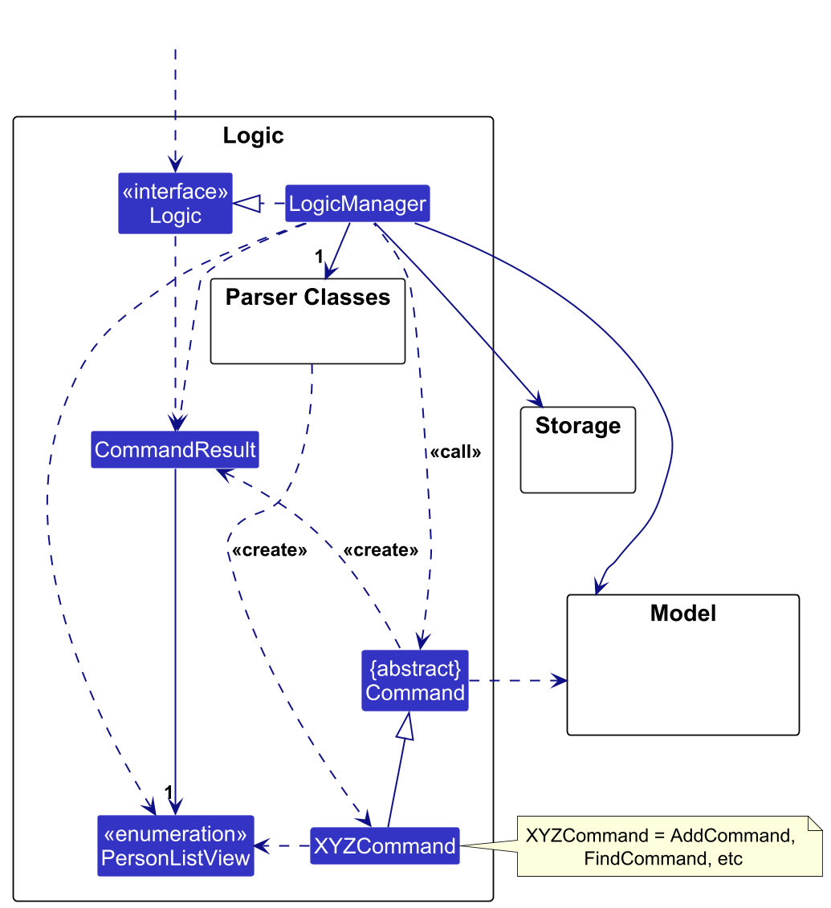
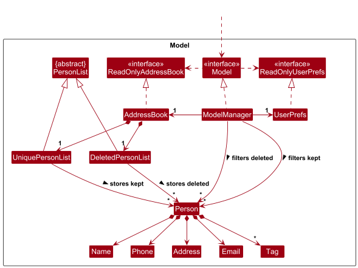

* Table of Contents
{:toc}

--------------------------------------------------------------------------------------------------------------------

## **Acknowledgements**

* OpenAI Codex was used to devise boilerplate tests based on natural-language specifications (e.g. "Make sure that a Notes instance can house any valid string value"). Its footprint can be found in most testing files and setup utilities in `src/test` as as result.

--------------------------------------------------------------------------------------------------------------------

## **Setting up, getting started**

Refer to the guide [_Setting up and getting started_](SettingUp.md).

--------------------------------------------------------------------------------------------------------------------

## **Design**

:bulb: **Tip:** The `.puml` files used to create diagrams are in this document `docs/diagrams` folder. Refer to the [_PlantUML Tutorial_ at se-edu/guides](https://se-education.org/guides/tutorials/plantUml.html) to learn how to create and edit diagrams.

### Architecture

The ***Architecture Diagram*** given above explains the high-level design of the App.

Given below is a quick overview of main components and how they interact with each other.

**Main components of the architecture**

**`Main`** (consisting of classes [`Main`](https://github.com/AY2526S2-CS2103T-T12-1/tp/tree/master/src/main/java/seedu/address/Main.java) and [`MainApp`](https://github.com/AY2526S2-CS2103T-T12-1/tp/tree/master/src/main/java/seedu/address/MainApp.java)) is in charge of the app launch and shut down.
* At app launch, it initializes the other components in the correct sequence, and connects them up with each other.
* At shut down, it shuts down the other components and invokes cleanup methods where necessary.

The bulk of the app's work is done by the following four components:

* [**`UI`**](#ui-component): The UI of the App.
* [**`Logic`**](#logic-component): The command executor.
* [**`Model`**](#model-component): Holds the data of the App in memory.
* [**`Storage`**](#storage-component): Reads data from, and writes data to, the hard disk.

[**`Commons`**](#common-classes) represents a collection of classes used by multiple other components.

**How the architecture components interact with each other**

The *Sequence Diagram* below shows how the components interact with each other for the scenario where the user issues the command `delete 1`.

Each of the four main components (also shown in the diagram above),

* defines its *API* in an `interface` with the same name as the Component.
* implements its functionality using a concrete `{Component Name}Manager` class (which follows the corresponding API `interface` mentioned in the previous point.

For example, the `Logic` component defines its API in the `Logic.java` interface and implements its functionality using the `LogicManager.java` class which follows the `Logic` interface. Other components interact with a given component through its interface rather than the concrete class (reason: to prevent outside component's being coupled to the implementation of a component), as illustrated in the (partial) class diagram below.

The sections below give more details of each component.

### UI component

The **API** of this component is specified in [`Ui.java`](https://github.com/AY2526S2-CS2103T-T12-1/tp/tree/master/src/main/java/seedu/address/ui/Ui.java)

The UI consists of a `MainWindow` that is made up of parts e.g.`CommandBox`, `ResultDisplay`, `PersonListPanel`, `StatusBarFooter` etc. All these, including the `MainWindow`, inherit from the abstract `UiPart` class which captures the commonalities between classes that represent parts of the visible GUI.

The `UI` component uses the JavaFx UI framework. The layout of these UI parts are defined in matching `.fxml` files that are in the `src/main/resources/view` folder. For example, the layout of the [`MainWindow`](https://github.com/AY2526S2-CS2103T-T12-1/tp/tree/master/src/main/java/seedu/address/ui/MainWindow.java) is specified in [`MainWindow.fxml`](https://github.com/AY2526S2-CS2103T-T12-1/tp/tree/master/src/main/resources/view/MainWindow.fxml)

The `UI` component,

* executes user commands using the `Logic` component.
* listens for changes to `Model` data so that the UI can be updated with the modified data.
* keeps a reference to the `Logic` component, because the `UI` relies on the `Logic` to execute commands.
* depends on some classes in the `Model` component, as it displays `Person` object residing in the `Model`.

### Logic component

**API** : [`Logic.java`](https://github.com/AY2526S2-CS2103T-T12-1/tp/tree/master/src/main/java/seedu/address/logic/Logic.java)

Here's a (partial) class diagram of the `Logic` component:

The sequence diagram below illustrates the interactions within the `Logic` component, taking `execute("delete 1")` API call as an example.

:information_source: **Note:** The lifeline for `DeleteCommandParser` should end at the destroy marker (X) but due to a limitation of PlantUML, the lifeline continues till the end of diagram.

How the `Logic` component works:

1. When `Logic` is called upon to execute a command, it is passed to an `AddressBookParser` object which in turn creates a parser that matches the command (e.g., `DeleteCommandParser`) and uses it to parse the command.
1. This results in a `Command` object (more precisely, an object of one of its subclasses e.g., `DeleteCommand`) which is executed by the `LogicManager`.
1. The command can communicate with the `Model` when it is executed (e.g. to delete a person). 
   Note that although this is shown as a single step in the diagram above (for simplicity), in the code it can take several interactions (between the command object and the `Model`) to achieve.
1. The result of the command execution is encapsulated as a `CommandResult` object which is returned back from `Logic`.

Here are the other classes in `Logic` (omitted from the class diagram above) that are used for parsing a user command:

How the parsing works:
* When called upon to parse a user command, the `AddressBookParser` class creates an `XYZCommandParser` (`XYZ` is a placeholder for the specific command name e.g., `AddCommandParser`) which uses the other classes shown above to parse the user command and create a `XYZCommand` object (e.g., `AddCommand`) which the `AddressBookParser` returns back as a `Command` object.
* All `XYZCommandParser` classes (e.g., `AddCommandParser`, `DeleteCommandParser`, ...) inherit from the `Parser` interface so that they can be treated similarly where possible e.g, during testing.

### Model component
**API** : [`Model.java`](https://github.com/AY2526S2-CS2103T-T12-1/tp/tree/master/src/main/java/seedu/address/model/Model.java)

The `Model` component,

* stores the address book data i.e., all `Person` objects (which are contained in a `UniquePersonList` object).
* stores the currently 'selected' `Person` objects (e.g., results of a search query) as a separate _filtered_ list which is exposed to outsiders as an unmodifiable `ObservableList<Person>` that can be 'observed' e.g. the UI can be bound to this list so that the UI automatically updates when the data in the list change.
* stores a `UserPref` object that represents the user’s preferences. This is exposed to the outside as a `ReadOnlyUserPref` objects.
* does not depend on any of the other three components (as the `Model` represents data entities of the domain, they should make sense on their own without depending on other components)

:information_source: **Note:** An alternative (arguably, a more OOP) model is given below. It has a `Tag` list in the `AddressBook`, which `Person` references. This allows `AddressBook` to only require one `Tag` object per unique tag, instead of each `Person` needing their own `Tag` objects. 

### Storage component

**API** : [`Storage.java`](https://github.com/AY2526S2-CS2103T-T12-1/tp/tree/master/src/main/java/seedu/address/storage/Storage.java)

The `Storage` component,
* can save both address book data and user preference data in JSON format, and read them back into corresponding objects.
* inherits from both `AddressBookStorage` and `UserPrefStorage`, which means it can be treated as either one (if only the functionality of only one is needed).
* depends on some classes in the `Model` component (because the `Storage` component's job is to save/retrieve objects that belong to the `Model`)

### Common classes

Classes used by multiple components are in the `seedu.address.commons` package.

--------------------------------------------------------------------------------------------------------------------

## **Implementation**

This section describes some noteworthy details on how certain features are implemented.

### \[Proposed\] Undo/redo feature

#### Proposed Implementation

The proposed undo/redo mechanism is facilitated by `VersionedAddressBook`. It extends `AddressBook` with an undo/redo history, stored internally as an `addressBookStateList` and `currentStatePointer`. Additionally, it implements the following operations:

* `VersionedAddressBook#commit()` — Saves the current address book state in its history.
* `VersionedAddressBook#undo()` — Restores the previous address book state from its history.
* `VersionedAddressBook#redo()` — Restores a previously undone address book state from its history.

These operations are exposed in the `Model` interface as `Model#commitAddressBook()`, `Model#undoAddressBook()` and `Model#redoAddressBook()` respectively.

Given below is an example usage scenario and how the undo/redo mechanism behaves at each step.

Step 1. The user launches the application for the first time. The `VersionedAddressBook` will be initialized with the initial address book state, and the `currentStatePointer` pointing to that single address book state.

Step 2. The user executes `delete 5` command to delete the 5th person in the address book. The `delete` command calls `Model#commitAddressBook()`, causing the modified state of the address book after the `delete 5` command executes to be saved in the `addressBookStateList`, and the `currentStatePointer` is shifted to the newly inserted address book state.

Step 3. The user executes `add n/David …​` to add a new person. The `add` command also calls `Model#commitAddressBook()`, causing another modified address book state to be saved into the `addressBookStateList`.

:information_source: **Note:** If a command fails its execution, it will not call `Model#commitAddressBook()`, so the address book state will not be saved into the `addressBookStateList`.

Step 4. The user now decides that adding the person was a mistake, and decides to undo that action by executing the `undo` command. The `undo` command will call `Model#undoAddressBook()`, which will shift the `currentStatePointer` once to the left, pointing it to the previous address book state, and restores the address book to that state.

:information_source: **Note:** If the `currentStatePointer` is at index 0, pointing to the initial AddressBook state, then there are no previous AddressBook states to restore. The `undo` command uses `Model#canUndoAddressBook()` to check if this is the case. If so, it will return an error to the user rather
than attempting to perform the undo.

The following sequence diagram shows how an undo operation goes through the `Logic` component:

:information_source: **Note:** The lifeline for `UndoCommand` should end at the destroy marker (X) but due to a limitation of PlantUML, the lifeline reaches the end of diagram.

Similarly, how an undo operation goes through the `Model` component is shown below:

The `redo` command does the opposite — it calls `Model#redoAddressBook()`, which shifts the `currentStatePointer` once to the right, pointing to the previously undone state, and restores the address book to that state.

:information_source: **Note:** If the `currentStatePointer` is at index `addressBookStateList.size() - 1`, pointing to the latest address book state, then there are no undone AddressBook states to restore. The `redo` command uses `Model#canRedoAddressBook()` to check if this is the case. If so, it will return an error to the user rather than attempting to perform the redo.

Step 5. The user then decides to execute the command `list`. Commands that do not modify the address book, such as `list`, will usually not call `Model#commitAddressBook()`, `Model#undoAddressBook()` or `Model#redoAddressBook()`. Thus, the `addressBookStateList` remains unchanged.

Step 6. The user executes `clear`, which calls `Model#commitAddressBook()`. Since the `currentStatePointer` is not pointing at the end of the `addressBookStateList`, all address book states after the `currentStatePointer` will be purged. Reason: It no longer makes sense to redo the `add n/David …​` command. This is the behavior that most modern desktop applications follow.

The following activity diagram summarizes what happens when a user executes a new command:

#### Design considerations:

**Aspect: How undo & redo executes:**

* **Alternative 1 (current choice):** Saves the entire address book.
  * Pros: Easy to implement.
  * Cons: May have performance issues in terms of memory usage.

* **Alternative 2:** Individual command knows how to undo/redo by
  itself.
  * Pros: Will use less memory (e.g. for `delete`, just save the person being deleted).
  * Cons: We must ensure that the implementation of each individual command are correct.

_{more aspects and alternatives to be added}_

### \[Proposed\] Data archiving

_{Explain here how the data archiving feature will be implemented}_

--------------------------------------------------------------------------------------------------------------------

## **Documentation, logging, testing, configuration, dev-ops**

* [Documentation guide](Documentation.md)
* [Testing guide](Testing.md)
* [Logging guide](Logging.md)
* [Configuration guide](Configuration.md)
* [DevOps guide](DevOps.md)

--------------------------------------------------------------------------------------------------------------------

## **Appendix: Requirements**

### Product scope

**Target user profile**:

* Is a volunteer coordinator who oversees manpower requirements of recurring events
* Manages contacts of 20-500 volunteers
* Works alone instead of in a team
* Prefers desktop apps over other types
* Can type fast
* Prefers typing to mouse interactions
* Is reasonably comfortable using CLI apps
* Values data privacy
* May perform duties in locations without an Internet connection
* Dislikes slow, repetitive tasks (e.g., editing tags of contacts one at a time)

**Value proposition**: RosterBolt is a single-user, offline, CLI-first contact management tool for volunteer coordinators to manage volunteers of recurring events (20-500 people). RosterBolt aims to reduce overhead of volunteer coordinators by streamlining repetitive admin work (e.g. deleting/modifying contacts in bulk) to enable them to efficiently and accurately manage volunteer manpower.

### User stories

Priorities: High (must have) - `* * *`, Medium (nice to have) - `* *`, Low (unlikely to have) - `*`

| Priority | As a …​                                    | I want to …​                     | So that I can…​                                                        |
| -------- | ------------------------------------------ | ------------------------------ | ---------------------------------------------------------------------- |
| `* * *` | fast typist | use a CLI to manage volunteers | perform tasks faster than using a GUI |
| `* * *` | user | see usage instructions | use the application without memorizing all commands |
| `* * *` | volunteer coordinator | add a new volunteer contact | keep track of people participating in my events |
| `* * *` | volunteer coordinator | include name, phone, email, address and tags when adding a contact | store structured volunteer information |
| `* * *` | volunteer coordinator | edit an existing volunteer’s contact details | keep volunteer information up to date |
| `* * *` | volunteer coordinator | update only specific fields of a contact | avoid re-entering all details |
| `* * *` | volunteer coordinator | delete a volunteer contact | remove volunteers who are no longer participating |
| `* * *` | volunteer coordinator | delete a volunteer by index in the list | act quickly without retyping names |
| `* * *` | volunteer coordinator | list all contacts | view my current volunteer roster |
| `* * *` | volunteer coordinator | search volunteers by name | quickly locate a specific volunteer |
| `* * *` | user | see confirmation messages after commands | avoid wasting time double-checking that my command was executed successfully |
| `* * *` | user | have my data automatically saved after each command | avoid manually saving data |
| `* * *` | returning user | automatically load my saved data on startup | continue from where I left off |
| `* *` | user | browse command history using arrow keys | reuse previously entered commands |
| `* *` | user | edit and re-run previous commands | quickly correct input mistakes |
| `* *` | fast typist | use tab completion for commands | execute commands with fewer keystrokes |
| `* *` | fast typist | define custom command aliases | tailor the application to my workflow |
| `* *` | volunteer coordinator | be warned when adding contacts with duplicate email or phone | avoid redundant volunteer records |
| `* *` | volunteer coordinator | include volunteer role information when adding a contact | track manpower allocation |
| `* *` | volunteer coordinator | include volunteer availability when adding a contact | plan recurring events efficiently |
| `* *` | volunteer coordinator | import volunteers from a CSV file | onboard an existing roster without retyping |
| `* *` | volunteer coordinator | assign or update volunteer roles when editing a contact | maintain accurate role allocation |
| `* *` | volunteer coordinator | assign volunteers to roles and receive warnings about availability conflicts | avoid scheduling clashes |
| `* *` | volunteer coordinator | unassign volunteers from roles without deleting their contact | adjust the roster easily |
| `* *` | volunteer coordinator | delete multiple contacts in one command | manage large volunteer rosters efficiently |
| `* *` | volunteer coordinator | restore recently deleted contacts | recover from accidental deletions |
| `* *` | volunteer coordinator | view deleted contacts in a recycle bin | prevent irreversible mistakes |
| `* *` | volunteer coordinator | sort contacts by name, phone, email, address or tag | organize my volunteer roster clearly |
| `* *` | volunteer coordinator | export volunteer information to a CSV file | analyze volunteer data using external tools |
| `* *` | volunteer coordinator | search across multiple fields (name, phone, email, address, tags) | locate volunteers using any known detail |
| `* *` | volunteer coordinator | search using multiple criteria | filter volunteers more precisely |
| `* *` | volunteer coordinator | search for volunteers available during a specific time period | create event rosters quickly |
| `*` | new user | see the application pre-populated with sample data | understand how the application works |
| `*` | new user | view the user guide | access documentation if I get stuck |
| `*` | volunteer coordinator at an event with poor internet connectivity | view the user guide offline | access documentation without internet |
| `*` | advanced user | read the data file easily | inspect or manipulate data using external tools |
| `*` | advanced user | transfer my data file between computers | migrate my data easily |
| `*` | user | have the data file reset automatically if it becomes corrupted | prevent the application from crashing |
| `*` | volunteer coordinator | add notes to volunteer contacts | remember important coordination context |
| `*` | volunteer coordinator | detect contacts with missing critical fields | fix incomplete records proactively |
| `*` | volunteer coordinator | bulk assign volunteers to roles or events | quickly create an event roster |
| `*` | volunteer coordinator | bulk unassign volunteers | reset assignments efficiently |
| `*` | volunteer coordinator | view volunteer statistics | understand manpower distribution |
| `*` | volunteer coordinator | view text-based role distribution graphs | analyze volunteer data in the CLI |
| `*` | volunteer coordinator | list volunteers sorted by least-recently-served | distribute workload more fairly |
| `*` | volunteer coordinator | export only selected fields to CSV | generate reports without exposing sensitive personal data |
| `*` | volunteer coordinator working in a public space | enable privacy mode | prevent accidental exposure of sensitive personal data |
| `*` | volunteer coordinator | find volunteers even when part of the name is remembered | locate contacts without exact matches |
| `*` | volunteer coordinator | find volunteers despite small typing mistakes | avoid slowdowns due to typos |
| `*` | volunteer coordinator | search names case-insensitively | avoid worrying about capitalization |

### Use cases

(For all use cases below, the **System** is RosterBolt and the **Actor** is the volunteer coordinator, unless specified otherwise)

**Use Case: Define Command Alias**

**Preconditions: Application is initialized**

**MSS:**

1. User requests to bind a specific alias to a specific target command.
2. System validates that the given alias does not conflict with pre-existing commands.
3. System maps the given alias to the given target command, and updates the storage file.
4. System informs user that the new alias has been successfully defined.
   Use case ends.

**Extensions:**

* 2a. The given alias conflicts with an existing command.
  * 2a1. System rejects the alias binding and issues an error.
  * 2a2. Use case ends.

**Use Case: Handle Duplicate Contact**

**MSS:**

1. System warns user that it detected a duplicate contact.
2. System asks the user if they wish to proceed.
3. User chooses to proceed.
4. System returns a “Proceed” signal to the calling use case.
   Use case ends.

**Extensions:**

* 2a. User chooses to cancel.
  * 2a1. System returns a “Cancel” signal to the calling use case.
  * 2a2. Use case ends.

**Use Case: Add Volunteer Contact**

**Preconditions: Application is initialized**

**Guarantees: Existing volunteer records are not modified.**

**MSS:**

1. User requests to add a new volunteer, supplying the volunteer's contact details, tags, roles, and availability.
2. System parses the arguments and validates the provided fields.
3. System syncs the new volunteer record to the storage file.
4. System informs user that the new volunteer has been added successfully.
   Use case ends.

**Extensions:**

* 2a. System detects invalid data (e.g. malformed email address or phone number).
  * 2a1. System stops the addition, and displays an error message detailing the specific validation failure.
  * 2a2. Use case ends.

* 2b. System detects a potential duplicate contact based on critical fields (e.g. duplicate email address or phone number).
  * 2b1. System performs Handle Duplicate Contact.
  * 2b2. If “Cancel” signal received, use case ends.
  * 2b3. If “Proceed” signal received, use case resumes from Step 3.

**Use Case: Assign Volunteer**

**Preconditions: Application is initialized, target volunteer and the target event constraints exist within the system.**

**Guarantees: Records of other volunteers are not modified.**

**MSS:**

1. User requests to assign a specific volunteer to a designated role for a specific event.
2. System cross-references the volunteer's current assignments to ensure no overlapping commitments exist for the specified event.
3. System cross-references the event's time period against the volunteer's registered availability windows.
4. System appends the new assignment to the volunteer's record.
5. System displays a confirmation of the assignment.
   Use case ends.

**Extensions:**

* 2a. System detects a scheduling conflict with an existing assignment (i.e. double-booking).
  * 2a1. System aborts the assignment, and issues an error detailing the conflicting event.
  * 2a2. Use case ends.

* 3a. The target event falls outside the volunteer's registered availability window.
  * 3a1. System stops the assignment, and displays an out-of-availability warning.
  * 3a2. User overrides the warning, acknowledging the out-of-availability assignment.
  * 3a3. Use case resumes at Step 4.

**Use Case: Export Roster Data to CSV**

**Preconditions: Application is initialized**

**MSS:**

1. User requests an export of the current roster, specifying a destination file path.
2. System serializes the current roster into a CSV file format.
3. System executes a file write operation to the specified location on the local filesystem.
4. System displays a success message indicating the CSV file was created.
   Use case ends.

**Extensions:**

* 1a. User specifies a parameter to exclusively export specific fields (e.g. exporting only names and roles, omitting addresses and phone numbers).
  * 1a1. System filters the serialized data, retaining only the explicitly requested columns.
  * 1a2. Use case resumes at Step 3.

### Non-Functional Requirements

**Performance**

1. The system should be able to handle up to 500 contacts without noticeable sluggishness during typical usage.
2. Bulk operations involving up to 100 contacts should complete within 2 seconds.

**Usability**

3. The system should provide clear feedback messages after each command to confirm successful execution or explain errors.
4. The system should be usable by a new user after reading the user guide once, without requiring external training.
5. A user with above-average typing speed should be able to accomplish most tasks faster using commands than using a mouse-driven interface.

**Reliability**

6. The system should automatically persist data after each command to prevent data loss in the event of unexpected termination.
7. If the data file becomes corrupted or invalid, the system should gracefully recover by resetting the data file or loading a safe default, instead of crashing.

**Offline Operation**

8. The system should function fully offline, without requiring any network connection during normal operation.
9. All documentation required for operation (e.g., help guide) should be accessible locally without internet access.

**Data Storage**

10. Application data should be stored in a human-readable file format (e.g., JSON or similar) so that advanced users can inspect or modify it using external tools.
11. The system should store all data locally on the user’s machine and must not depend on external databases or servers.

**Portability**

12. The application should work on any mainstream OS as long as Java 17 or above is installed.

### Glossary

|             Term              | Definition                                                                                                                       |
|:-----------------------------:|:---------------------------------------------------------------------------------------------------------------------------------|
|             Alias             | A user-defined shortcut that maps a short command to a longer target command.                                                    |
|      Availability Window      | The time period during which a volunteer is available to participate in events.                                                  |
|        Bulk Operation         | An operation that applies to multiple contacts within a single command (e.g., deleting or assigning several volunteers at once). |
| CSV (Comma-Separated Values)  | A text file format used to store tabular data, used by the system for importing or exporting volunteer records.                  |
|       Duplicate Contact       | A contact that shares critical identifying fields (e.g., phone number or email address) with an existing contact in the system.  |
|         Mainstream OS         | Windows, Linux, Unix, macOS.                                                                                                     |
|         Privacy Mode          | A display mode that masks sensitive personal details such as phone numbers or email addresses.                                   |
|              Tag              | A user-defined label used to categorize volunteers (e.g., “first-aid”, “logistics”).                                             |

--------------------------------------------------------------------------------------------------------------------

## **Appendix: Instructions for manual testing**

Given below are instructions to test the app manually.

:information_source: **Note:** These instructions only provide a starting point for testers to work on;
testers are expected to do more *exploratory* testing.

### Launch and shutdown

1. Initial launch

   1. Download the jar file and copy into an empty folder

   1. Double-click the jar file Expected: Shows the GUI with a set of sample contacts. The window size may not be optimum.

1. Saving window preferences

   1. Resize the window to an optimum size. Move the window to a different location. Close the window.

   1. Re-launch the app by double-clicking the jar file. 
       Expected: The most recent window size and location is retained.

1. _{ more test cases …​ }_

### Deleting a person

1. Deleting a person while all persons are being shown

   1. Prerequisites: List all persons using the `list` command. Multiple persons in the list.

   1. Test case: `delete 1` 
      Expected: First contact is deleted from the list. Details of the deleted contact shown in the status message. Timestamp in the status bar is updated.

   1. Test case: `delete 0` 
      Expected: No person is deleted. Error details shown in the status message. Status bar remains the same.

   1. Other incorrect delete commands to try: `delete`, `delete x`, `...` (where x is larger than the list size) 
      Expected: Similar to previous.

1. _{ more test cases …​ }_

### Saving data

1. Dealing with missing/corrupted data files

   1. _{explain how to simulate a missing/corrupted file, and the expected behavior}_

1. _{ more test cases …​ }_
