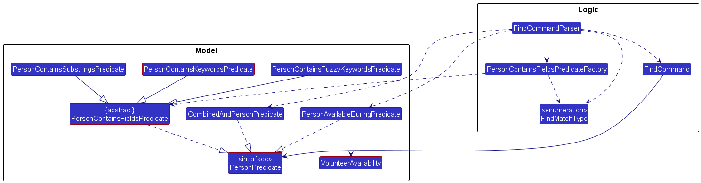
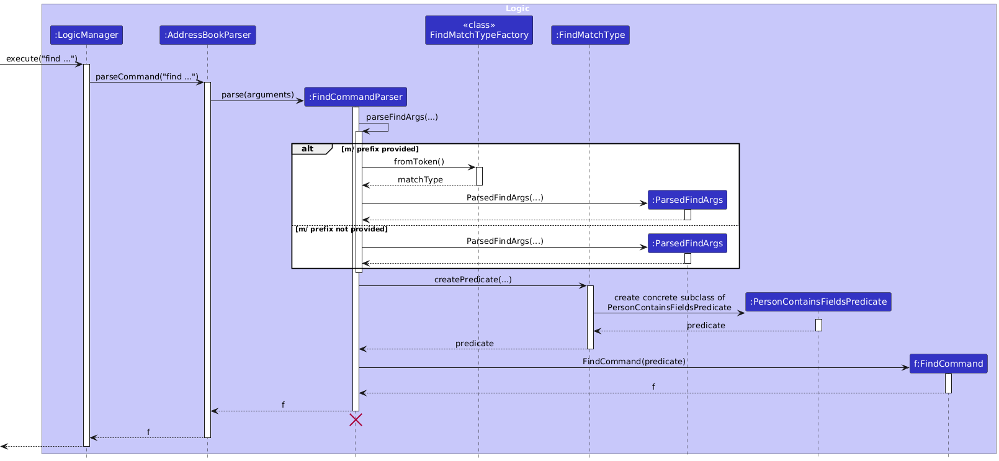
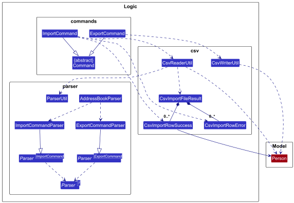
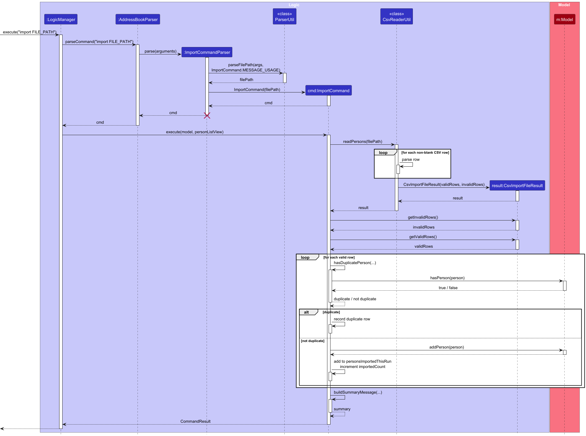

* Table of Contents
{:toc}

--------------------------------------------------------------------------------------------------------------------

## **Acknowledgements**

* OpenAI Codex was used to devise boilerplate tests based on natural-language specifications (e.g. "Make sure that a Notes instance can house any valid string value"). Its footprint can be found in most testing files and setup utilities in `src/test` as as result.

--------------------------------------------------------------------------------------------------------------------

## **Setting up, getting started**

Refer to the guide [_Setting up and getting started_](SettingUp.md).

--------------------------------------------------------------------------------------------------------------------

## **Design**

:bulb: **Tip:** The `.puml` files used to create diagrams are in this document `docs/diagrams` folder. Refer to the [_PlantUML Tutorial_ at se-edu/guides](https://se-education.org/guides/tutorials/plantUml.html) to learn how to create and edit diagrams.

### Architecture

The ***Architecture Diagram*** given above explains the high-level design of the App.

Given below is a quick overview of main components and how they interact with each other.

**Main components of the architecture**

**`Main`** (consisting of classes [`Main`](https://github.com/AY2526S2-CS2103T-T12-1/tp/tree/master/src/main/java/seedu/address/Main.java) and [`MainApp`](https://github.com/AY2526S2-CS2103T-T12-1/tp/tree/master/src/main/java/seedu/address/MainApp.java)) is in charge of the app launch and shut down.
* At app launch, it initializes the other components in the correct sequence, and connects them up with each other.
* At shut down, it shuts down the other components and invokes cleanup methods where necessary.

The bulk of the app's work is done by the following four components:

* [**`UI`**](#ui-component): The UI of the App.
* [**`Logic`**](#logic-component): The command executor.
* [**`Model`**](#model-component): Holds the data of the App in memory.
* [**`Storage`**](#storage-component): Reads data from, and writes data to, the hard disk.

[**`Commons`**](#common-classes) represents a collection of classes used by multiple other components.

**How the architecture components interact with each other**

The *Sequence Diagram* below shows how the components interact with each other for the scenario where the user issues the command `delete 1`.

Each of the four main components (also shown in the diagram above),

* defines its *API* in an `interface` with the same name as the Component.
* implements its functionality using a concrete `{Component Name}Manager` class (which follows the corresponding API `interface` mentioned in the previous point.

For example, the `Logic` component defines its API in the `Logic.java` interface and implements its functionality using the `LogicManager.java` class which follows the `Logic` interface. Other components interact with a given component through its interface rather than the concrete class (reason: to prevent outside component's being coupled to the implementation of a component), as illustrated in the (partial) class diagram below.

The sections below give more details of each component.

### UI component

The **API** of this component is specified in [`Ui.java`](https://github.com/AY2526S2-CS2103T-T12-1/tp/tree/master/src/main/java/seedu/address/ui/Ui.java)

The UI consists of a `MainWindow` that is made up of parts e.g.`CommandBox`, `ResultDisplay`, `PersonListPanel`, `StatusBarFooter` etc. All these, including the `MainWindow`, inherit from the abstract `UiPart` class which captures the commonalities between classes that represent parts of the visible GUI.

The `UI` component uses the JavaFx UI framework. The layout of these UI parts are defined in matching `.fxml` files that are in the `src/main/resources/view` folder. For example, the layout of the [`MainWindow`](https://github.com/AY2526S2-CS2103T-T12-1/tp/tree/master/src/main/java/seedu/address/ui/MainWindow.java) is specified in [`MainWindow.fxml`](https://github.com/AY2526S2-CS2103T-T12-1/tp/tree/master/src/main/resources/view/MainWindow.fxml)

The `UI` component,

* executes user commands using the `Logic` component.
* listens for changes to `Model` data so that the UI can be updated with the modified data.
* keeps a reference to the `Logic` component, because the `UI` relies on the `Logic` to execute commands.
* depends on some classes in the `Model` component, as it displays `Person` object residing in the `Model`.

### Logic component

**API** : [`Logic.java`](https://github.com/AY2526S2-CS2103T-T12-1/tp/tree/master/src/main/java/seedu/address/logic/Logic.java)

Here's a (partial) class diagram of the `Logic` component:

The sequence diagram below illustrates the interactions within the `Logic` component, taking `execute("delete 1")` API call as an example.

:information_source: **Note:** The lifeline for `DeleteCommandParser` should end at the destroy marker (X) but due to a limitation of PlantUML, the lifeline continues till the end of diagram.

How the `Logic` component works:

1. When `Logic` is called upon to execute a command, it is passed to an `AddressBookParser` object which in turn creates a parser that matches the command (e.g., `DeleteCommandParser`) and uses it to parse the command.
1. This results in a `Command` object (more precisely, an object of one of its subclasses e.g., `DeleteCommand`) which is executed by the `LogicManager`.
1. The command can communicate with the `Model` when it is executed (e.g. to delete a person). 
   Note that in the sequence diagram above, the interactions between the command object and the `Model` are simplified.
1. The result of the command execution is encapsulated as a `CommandResult` object which is returned back from `Logic`.

Here are the other classes in `Logic` (omitted from the class diagram above) that are used for parsing a user command:

How the parsing works:
* When called upon to parse a user command, the `AddressBookParser` class creates an `XYZCommandParser` (`XYZ` is a placeholder for the specific command name e.g., `AddCommandParser`) which uses the other classes shown above to parse the user command and create a `XYZCommand` object (e.g., `AddCommand`) which the `AddressBookParser` returns back as a `Command` object.
* All `XYZCommandParser` classes (e.g., `AddCommandParser`, `DeleteCommandParser`, ...) inherit from the `Parser` interface so that they can be treated similarly where possible e.g, during testing.
* Alias validation uses `CommandWords` as the canonical source of reserved command words and allowed alias targets. `TOP_LEVEL_COMMAND_WORDS` defines reserved command words, while allowed alias targets are derived from it by excluding disallowed meta-commands. When adding a new top-level command, update both `AddressBookParser` and `CommandWords` so parsing and alias behavior stay in sync.

### Model component
**API** : [`Model.java`](https://github.com/AY2526S2-CS2103T-T12-1/tp/tree/master/src/main/java/seedu/address/model/Model.java)

Continuing the example of the `delete` command, the `Model` component executes the `deletePerson` method with a `Person p` as its argument. The sequence diagram below illustrates the interactions within the `Model` component.

The `Model` component,

* stores the address book data i.e., all `Person` objects. `Person` objects in the user's current list of contacts are contained in a `UniquePersonList` object. `Person` objects corresponding to contacts that are deleted in the current session are stored in a separate `DeletedPersonList` object.
* stores the currently 'selected' `Person` objects (e.g., results of a search query) as a separate _filtered_ list which is exposed to outsiders as a _sorted_ and unmodifiable `ObservableList<Person>` that can be 'observed' e.g. the UI can be bound to this list so that the UI automatically updates when the data in the list change. Sorting is driven by a comparator set on the `Model`, and defaults to insertion order when no comparator is set.
* stores a `UserPref` object that represents the user’s preferences. This is exposed to the outside as a `ReadOnlyUserPref` objects.
* does not depend on any of the other three components (as the `Model` represents data entities of the domain, they should make sense on their own without depending on other components)

:information_source: **Note:** An alternative (arguably, a more OOP) model is given below. It has a `Tag` list in the `AddressBook`, which `Person` references. This allows `AddressBook` to only require one `Tag` object per unique tag, instead of each `Person` needing their own `Tag` objects. 

### Storage component

**API** : [`Storage.java`](https://github.com/AY2526S2-CS2103T-T12-1/tp/tree/master/src/main/java/seedu/address/storage/Storage.java)

The `Storage` component,
* can save both address book data and user preference data in JSON format, and read them back into corresponding objects.
* inherits from both `AddressBookStorage` and `UserPrefStorage`, which means it can be treated as either one (if only the functionality of only one is needed).
* depends on some classes in the `Model` component (because the `Storage` component's job is to save/retrieve objects that belong to the `Model`)

### Common classes

Classes used by multiple components are in the `seedu.address.commons` package.

--------------------------------------------------------------------------------------------------------------------

## **Implementation**

This section describes some noteworthy details on how certain features are implemented.

### Find command

The `find` command is implemented as a small "pipeline" that converts user input into a single `PersonPredicate` object, and then updates the model's filtered person list by applying that predicate. The command supports text-based keyword matching (via `m/` prefix) and volunteer availability filtering (via `va/` prefix), either independently or combined. The diagram below summarizes the key classes and their relationships.

#### Parsing flow

The sequence diagram below shows how the `find` command arguments are transformed into a `FindCommand` with the appropriate predicate.

The parsing flow is as follows:
* `LogicManager` calls `AddressBookParser#parseCommand()`, which instantiates a `FindCommandParser` for the `find` command.
* `FindCommandParser#parseArgs(...)` processes the argument multimap:
  * If the user provides an `m/` prefix, `FindMatchType.fromToken()` determines the match type; otherwise the default keyword match type is assumed.
  * If the user provides a `va/` prefix, `VolunteerAvailability.fromString()` parses the availability time period.
  * Keywords are extracted from the trailing content after the last prefix, or from the preamble when no prefixes are used.
  * All parsed arguments are stored in a `ParsedFindArgs` object.
* `FindCommandParser#buildPredicate(...)` creates the appropriate predicate:
  * **Keywords only**: `PersonContainsFieldsPredicateFactory.createPredicate(...)` returns a text-matching predicate.
  * **Availability only**: a `PersonAvailableDuringPredicate` is created, which checks that a volunteer's availability fully covers the queried time period.
  * **Both keywords and availability**: a `CombinedAndPersonPredicate` is created, which ANDs the text predicate and availability predicate together.
* `FindCommandParser` constructs the `FindCommand` with the predicate and returns it to `AddressBookParser`, which returns it to `LogicManager`.

#### Predicate structure

All find predicates implement `PersonPredicate`, which is a `Predicate<Person>`. There are three families of predicates:

**Text-matching predicates** share an abstract base class (`PersonContainsFieldsPredicate`) that:

* iterates through each keyword
* returns `true` as soon as any keyword matches any supported field (i.e. `OR` semantics across keywords)
* checks the keyword against most `Person` fields (e.g. name, phone, email, address, role, notes, tags)
* delegates the actual field-matching logic to `matchesField(...)`
* concrete predicate classes implement the `matchesField(...)` method, keeping the overall matching logic consistent and easy to extend

**`PersonAvailableDuringPredicate`** checks whether any of a person's `VolunteerAvailability` entries fully cover the queried time period (same day, starts at or before query start, ends at or after query end).

**`CombinedAndPersonPredicate`** takes a list of `PersonPredicate` objects and requires all of them to match (AND logic). This is used when both keywords and availability are specified.

#### Extending find

To add a new text match type in the future:

* implement a new subclass of `PersonContainsFieldsPredicate`
* add a new enum value and token in `FindMatchType`
* update `PersonContainsFieldsPredicateFactory.createPredicate(...)` to return the new predicate for that match type
* update any docs that mention match types (the parser logic does not need to change if the match type continues to be provided via `m/`)

To add a new filter dimension (like availability):

* implement a new `PersonPredicate` subclass
* integrate it into `FindCommandParser#parseArgs(...)` and `buildPredicate(...)`
* `CombinedAndPersonPredicate` can compose any number of predicates together

### \[Proposed\] Undo/redo feature

#### Proposed Implementation

The proposed undo/redo mechanism is facilitated by `VersionedAddressBook`. It extends `AddressBook` with an undo/redo history, stored internally as an `addressBookStateList` and `currentStatePointer`. Additionally, it implements the following operations:

* `VersionedAddressBook#commit()` — Saves the current address book state in its history.
* `VersionedAddressBook#undo()` — Restores the previous address book state from its history.
* `VersionedAddressBook#redo()` — Restores a previously undone address book state from its history.

These operations are exposed in the `Model` interface as `Model#commitAddressBook()`, `Model#undoAddressBook()` and `Model#redoAddressBook()` respectively.

Given below is an example usage scenario and how the undo/redo mechanism behaves at each step.

Step 1. The user launches the application for the first time. The `VersionedAddressBook` will be initialized with the initial address book state, and the `currentStatePointer` pointing to that single address book state.

Step 2. The user executes `delete 5` command to delete the 5th person in the address book. The `delete` command calls `Model#commitAddressBook()`, causing the modified state of the address book after the `delete 5` command executes to be saved in the `addressBookStateList`, and the `currentStatePointer` is shifted to the newly inserted address book state.

Step 3. The user executes `add n/David …​` to add a new person. The `add` command also calls `Model#commitAddressBook()`, causing another modified address book state to be saved into the `addressBookStateList`.

:information_source: **Note:** If a command fails its execution, it will not call `Model#commitAddressBook()`, so the address book state will not be saved into the `addressBookStateList`.

Step 4. The user now decides that adding the person was a mistake, and decides to undo that action by executing the `undo` command. The `undo` command will call `Model#undoAddressBook()`, which will shift the `currentStatePointer` once to the left, pointing it to the previous address book state, and restores the address book to that state.

:information_source: **Note:** If the `currentStatePointer` is at index 0, pointing to the initial AddressBook state, then there are no previous AddressBook states to restore. The `undo` command uses `Model#canUndoAddressBook()` to check if this is the case. If so, it will return an error to the user rather
than attempting to perform the undo.

The following sequence diagram shows how an undo operation goes through the `Logic` component:

:information_source: **Note:** The lifeline for `UndoCommand` should end at the destroy marker (X) but due to a limitation of PlantUML, the lifeline reaches the end of diagram.

Similarly, how an undo operation goes through the `Model` component is shown below:

The `redo` command does the opposite — it calls `Model#redoAddressBook()`, which shifts the `currentStatePointer` once to the right, pointing to the previously undone state, and restores the address book to that state.

:information_source: **Note:** If the `currentStatePointer` is at index `addressBookStateList.size() - 1`, pointing to the latest address book state, then there are no undone AddressBook states to restore. The `redo` command uses `Model#canRedoAddressBook()` to check if this is the case. If so, it will return an error to the user rather than attempting to perform the redo.

Step 5. The user then decides to execute the command `list`. Commands that do not modify the address book, such as `list`, will usually not call `Model#commitAddressBook()`, `Model#undoAddressBook()` or `Model#redoAddressBook()`. Thus, the `addressBookStateList` remains unchanged.

Step 6. The user executes `clear`, which calls `Model#commitAddressBook()`. Since the `currentStatePointer` is not pointing at the end of the `addressBookStateList`, all address book states after the `currentStatePointer` will be purged. Reason: It no longer makes sense to redo the `add n/David …​` command. This is the behavior that most modern desktop applications follow.

The following activity diagram summarizes what happens when a user executes a new command:

#### Design considerations:

**Aspect: How undo & redo executes:**

* **Alternative 1 (current choice):** Saves the entire address book.
  * Pros: Easy to implement.
  * Cons: May have performance issues in terms of memory usage.

* **Alternative 2:** Individual command knows how to undo/redo by
  itself.
  * Pros: Will use less memory (e.g. for `delete`, just save the person being deleted).
  * Cons: We must ensure that the implementation of each individual command are correct.

_{more aspects and alternatives to be added}_

### \[Proposed\] Data archiving

_{Explain here how the data archiving feature will be implemented}_

### CSV import/export commands

The `import` and `export` commands extend the application with CSV file support. Both commands follow a similar flow: user input is parsed into a command object, and CSV-specific processing is handled by dedicated classes.

At a high level:

* `AddressBookParser#parseCommand()` identifies the command word and passes control to either `ImportCommandParser` or `ExportCommandParser`.
* The respective parser validates the file path and creates an `ImportCommand` or `ExportCommand`.

For the `export` command:

* `ExportCommand` retrieves the active list of persons from `Model`.
* It then calls `CsvWriterUtil` to convert the data into CSV format and write it to the file.

For the `import` command:

* `ImportCommand` calls `CsvReaderUtil` to read and process the CSV file.
* `CsvReaderUtil` validates the file (e.g. header row), parses each non-blank row, and returns a `CsvImportFileResult` containing:
    * successfully parsed rows (`CsvImportRowSuccess`)
    * invalid rows (`CsvImportRowError`)
* `ImportCommand` retrieves valid and invalid rows from `CsvImportFileResult`.
* For each valid row, `ImportCommand`:
    * checks for duplicates using `Model#hasPerson(...)` and previously imported entries
    * skips duplicates and records them
    * adds non-duplicate persons to the model
* Finally, `ImportCommand` returns a summary showing the number of imported, duplicate, and invalid rows.

The sequence diagram below illustrates the execution of the `import` command.

The CSV-specific logic is contained in the `logic.csv` package:

* `CsvReaderUtil` reads the file, validates its structure, and converts rows into structured results.
* `CsvWriterUtil` converts `Person` objects into CSV format and writes them to a file.
* `CsvImportFileResult` and related classes store parsed data and row-level errors.

This design keeps command classes focused on coordinating the workflow, while CSV-related processing is handled by specialised classes.

--------------------------------------------------------------------------------------------------------------------

## **Documentation, logging, testing, configuration, dev-ops**

* [Documentation guide](Documentation.md)
* [Testing guide](Testing.md)
* [Logging guide](Logging.md)
* [Configuration guide](Configuration.md)
* [DevOps guide](DevOps.md)

--------------------------------------------------------------------------------------------------------------------

## **Appendix: Requirements**

### Product scope

**Target user profile**:

* Is a volunteer coordinator who oversees manpower requirements of recurring events
* Manages contacts of 20-500 volunteers
* Works alone instead of in a team
* Prefers desktop apps over other types
* Can type fast
* Prefers typing to mouse interactions
* Is reasonably comfortable using CLI apps
* Values data privacy
* May perform duties in locations without an Internet connection
* Dislikes slow, repetitive tasks (e.g., editing tags of contacts one at a time)

**Value proposition**: RosterBolt is a single-user, offline, CLI-first contact management tool for volunteer coordinators to manage volunteers of recurring events (20-500 people). RosterBolt aims to reduce overhead of volunteer coordinators by streamlining repetitive admin work (e.g. deleting/modifying contacts in bulk) to enable them to efficiently and accurately manage volunteer manpower.

### User stories

Priorities: High (must have) - `* * *`, Medium (nice to have) - `* *`, Low (unlikely to have) - `*`

| Priority | As a …​                                    | I want to …​                     | So that I can…​                                                        |
| -------- | ------------------------------------------ | ------------------------------ | ---------------------------------------------------------------------- |
| `* * *` | fast typist | use a CLI to manage volunteers | perform tasks faster than using a GUI |
| `* * *` | user | see usage instructions | use the application without memorizing all commands |
| `* * *` | volunteer coordinator | add a new volunteer contact | keep track of people participating in my events |
| `* * *` | volunteer coordinator | include name, phone, email, address and tags when adding a contact | store structured volunteer information |
| `* * *` | volunteer coordinator | edit an existing volunteer’s contact details | keep volunteer information up to date |
| `* * *` | volunteer coordinator | update only specific fields of a contact | avoid re-entering all details |
| `* * *` | volunteer coordinator | delete a volunteer contact | remove volunteers who are no longer participating |
| `* * *` | volunteer coordinator | delete a volunteer by index in the list | act quickly without retyping names |
| `* * *` | volunteer coordinator | list all contacts | view my current volunteer roster |
| `* * *` | volunteer coordinator | search volunteers by name | quickly locate a specific volunteer |
| `* * *` | user | see confirmation messages after commands | avoid wasting time double-checking that my command was executed successfully |
| `* * *` | user | have my data automatically saved after each command | avoid manually saving data |
| `* * *` | returning user | automatically load my saved data on startup | continue from where I left off |
| `* *` | user | edit and re-run previous commands | quickly correct input mistakes |
| `* *` | fast typist | define custom command aliases | tailor the application to my workflow |
| `* *` | volunteer coordinator | be warned when adding contacts with duplicate email or phone | avoid redundant volunteer records |
| `* *` | volunteer coordinator | include volunteer role information when adding a contact | track manpower allocation |
| `* *` | volunteer coordinator | include volunteer availability when adding a contact | plan recurring events efficiently |
| `* *` | volunteer coordinator | import volunteers from a CSV file | onboard an existing roster without retyping |
| `* *` | volunteer coordinator | assign or update volunteer roles when editing a contact | maintain accurate role allocation |
| `* *` | volunteer coordinator | unassign volunteers from roles without deleting their contact | adjust the roster easily |
| `* *` | volunteer coordinator | delete multiple contacts in one command | manage large volunteer rosters efficiently |
| `* *` | volunteer coordinator | restore recently deleted contacts | recover from accidental deletions |
| `* *` | volunteer coordinator | view deleted contacts in a recycle bin | prevent irreversible mistakes |
| `* *` | volunteer coordinator | sort contacts by name, phone, email, address or tag | organize my volunteer roster clearly |
| `* *` | volunteer coordinator | export volunteer information to a CSV file | analyze volunteer data using external tools |
| `* *` | volunteer coordinator | search across multiple fields (name, phone, email, address, role, notes, tags) | locate volunteers using any known detail |
| `* *` | volunteer coordinator | search using multiple criteria | filter volunteers more precisely |
| `* *` | volunteer coordinator | search for volunteers available during a specific time period | create event rosters quickly |
| `*` | new user | see the application pre-populated with sample data | understand how the application works |
| `*` | new user | view the user guide | access documentation if I get stuck |
| `*` | advanced user | read the data file easily | inspect or manipulate data using external tools |
| `*` | advanced user | transfer my data file between computers | migrate my data easily |
| `*` | user | have the data file reset automatically if it becomes corrupted | prevent the application from crashing |
| `*` | volunteer coordinator | add notes to volunteer contacts | remember important coordination context |
| `*` | volunteer coordinator | detect contacts with missing critical fields | fix incomplete records proactively |
| `*` | volunteer coordinator | bulk assign volunteers to roles or events | quickly create an event roster |
| `*` | volunteer coordinator | bulk unassign volunteers | reset assignments efficiently |
| `*` | volunteer coordinator | view volunteer statistics | understand manpower distribution |
| `*` | volunteer coordinator | view text-based role distribution graphs | analyze volunteer data in the CLI |
| `*` | volunteer coordinator | list volunteers sorted by least-recently-served | distribute workload more fairly |
| `*` | volunteer coordinator | find volunteers even when part of the name is remembered | locate contacts without exact matches |
| `*` | volunteer coordinator | find volunteers despite small typing mistakes | avoid slowdowns due to typos |
| `*` | volunteer coordinator | search names case-insensitively | avoid worrying about capitalization |

### Use cases

(For all use cases below, the **System** is RosterBolt and the **Actor** is the volunteer coordinator, unless specified otherwise)

**Use Case: Define Command Alias**

**Preconditions: Application is initialized**

**MSS:**

1. User requests to bind a specific alias to a specific built-in target command word.
2. System validates that the given alias does not conflict with pre-existing commands, and that the target command word is supported for aliasing.
3. System maps the given alias to the given target command word, and updates the storage file.
4. System informs user that the new alias has been successfully defined.
   Use case ends.

**Extensions:**

* 2a. The given alias conflicts with an existing command.
  * 2a1. System rejects the alias binding and issues an error.
  * 2a2. Use case ends.

* 2b. The target command word is not supported for aliasing.
  * 2b1. System rejects the alias binding and issues an error.
  * 2b2. Use case ends.

**Startup behavior note (aliases):**
- On application startup, aliases loaded from preferences are revalidated against current alias rules.
- Invalid entries are removed, and a one-time warning is shown in the result display.

**Use Case: Handle Duplicate Contact**

**MSS:**

1. System warns user that it detected a duplicate contact.
2. System asks the user if they wish to proceed.
3. User chooses to proceed.
4. System returns a “Proceed” signal to the calling use case.
   Use case ends.

**Extensions:**

* 2a. User chooses to cancel.
  * 2a1. System returns a “Cancel” signal to the calling use case.
  * 2a2. Use case ends.

**Use Case: Add Volunteer Contact**

**Preconditions: Application is initialized**

**Guarantees: Existing volunteer records are not modified.**

**MSS:**

1. User requests to add a new volunteer, supplying the volunteer's contact details, tags, roles, and availability.
2. System parses the arguments and validates the provided fields.
3. System syncs the new volunteer record to the storage file.
4. System informs user that the new volunteer has been added successfully.
   Use case ends.

**Extensions:**

* 2a. System detects invalid data (e.g. malformed email address or phone number).
  * 2a1. System stops the addition, and displays an error message detailing the specific validation failure.
  * 2a2. Use case ends.

* 2b. System detects a potential duplicate contact based on critical fields (e.g. duplicate email address or phone number).
  * 2b1. System performs Handle Duplicate Contact.
  * 2b2. If “Cancel” signal received, use case ends.
  * 2b3. If “Proceed” signal received, use case resumes from Step 3.

**Use Case: Export Roster Data to CSV**

**Preconditions: Application is initialized**

**MSS:**

1. User requests an export of the current roster, specifying a destination file path.
2. System serializes the current roster into a CSV file format.
3. System executes a file write operation to the specified location on the local filesystem.
4. System displays a success message indicating the CSV file was created.
   Use case ends.

### Non-Functional Requirements

**Performance**

1. The system should be able to handle up to 500 contacts without noticeable sluggishness during typical usage.
2. Bulk operations involving up to 100 contacts should complete within 2 seconds.

**Usability**

3. The system should provide clear feedback messages after each command to confirm successful execution or explain errors.
4. The system should be usable by a new user after reading the user guide once, without requiring external training.
5. A user with above-average typing speed should be able to accomplish most tasks faster using commands than using a mouse-driven interface.

**Reliability**

6. The system should automatically persist data after each command to prevent data loss in the event of unexpected termination.
7. If the data file becomes corrupted or invalid, the system should gracefully recover by resetting the data file or loading a safe default, instead of crashing.

**Offline Operation**

8. The system should function fully offline, without requiring any network connection during normal operation.
9. All documentation required for operation (e.g., help guide) should be accessible locally without internet access.

**Data Storage**

10. Application data should be stored in a human-readable file format (e.g., JSON or similar) so that advanced users can inspect or modify it using external tools.
11. The system should store all data locally on the user’s machine and must not depend on external databases or servers.

**Portability**

12. The application should work on any mainstream OS as long as Java 17 or above is installed.

### Glossary

|             Term              | Definition                                                                                                                       |
|:-----------------------------:|:---------------------------------------------------------------------------------------------------------------------------------|
|             Alias             | A user-defined shortcut that maps a short command word to a supported built-in command word.                                     |
|      Availability Window      | The time period during which a volunteer is available to participate in events.                                                  |
|        Bulk Operation         | An operation that applies to multiple contacts within a single command (e.g., deleting or assigning several volunteers at once). |
| CSV (Comma-Separated Values)  | A text file format used to store tabular data, used by the system for importing or exporting volunteer records.                  |
|       Duplicate Contact       | A contact that shares critical identifying fields (e.g., phone number or email address) with an existing contact in the system.  |
|         Mainstream OS         | Windows, Linux, Unix, macOS.                                                                                                     |
|              Tag              | A user-defined label used to categorize volunteers (e.g., “first-aid”, “logistics”).                                             |

--------------------------------------------------------------------------------------------------------------------

## **Appendix: Instructions for manual testing**

Given below are instructions to test the app manually.

:information_source: **Note:** These instructions only provide a starting point for testers to work on;
testers are expected to do more *exploratory* testing.

### Launch and shutdown

1. Initial launch

   1. Download the jar file and copy into an empty folder

   1. Double-click the jar file Expected: Shows the GUI with a set of sample contacts. The window size may not be optimum.

1. Saving window preferences

   1. Resize the window to an optimum size. Move the window to a different location. Close the window.

   1. Re-launch the app by double-clicking the jar file. 
       Expected: The most recent window size and location is retained.

1. Launching with missing data file

   1. Delete the `data/rosterbolt.json` file (if it exists) and launch the app. 
      Expected: The app launches with sample contacts pre-loaded. A new data file is created after the first command.

### Adding a person

1. Adding a person with all required fields

   1. Test case: `add n/John Doe p/98765432 e/johnd@example.com a/311 Clementi Ave 2` 
      Expected: A new contact is added with the given details. Status message shows the added contact's details.

   1. Test case: `add n/Jane Doe p/91234567 e/jane@example.com a/Blk 30 r/Usher nt/Prefers mornings t/volunteer` 
      Expected: Contact added with role, notes, and tag fields populated.

1. Adding a person with invalid fields

   1. Test case: `add n/John Doe p/12 e/johnd@example.com a/addr` 
      Expected: Error message about phone number requiring at least 3 digits. No contact added.

   1. Test case: `add n/John Doe p/98765432 e/invalid a/addr` 
      Expected: Error message about invalid email format. No contact added.

   1. Test case: `add n/ p/98765432 e/johnd@example.com a/addr` 
      Expected: Error message about blank name. No contact added.

1. Adding a duplicate person

   1. Prerequisites: A contact with phone `98765432` or email `johnd@example.com` already exists.

   1. Test case: `add n/Different Name p/98765432 e/new@example.com a/addr` 
      Expected: Error message indicating a duplicate person was found. No contact added.

### Editing a person

1. Editing a person's fields

   1. Prerequisites: List all persons using `list`. At least one person in the list.

   1. Test case: `edit 1 p/91234567` 
      Expected: First person's phone number is updated. Status message shows the edited contact.

   1. Test case: `edit 1 n/New Name e/new@example.com` 
      Expected: First person's name and email are updated.

1. Editing with no fields provided

   1. Test case: `edit 1` 
      Expected: Error message indicating at least one field must be provided.

1. Editing to create a duplicate

   1. Prerequisites: At least two persons in the list.

   1. Test case: `edit 1 p/PHONE_OF_SECOND_PERSON` 
      Expected: Error message indicating this person already exists in the address book.

### Finding persons

1. Finding by keyword (default)

   1. Prerequisites: Multiple persons in the list, including one named "Alice".

   1. Test case: `find Alice` 
      Expected: Persons matching "Alice" are listed. Count shown in status message.

   1. Test case: `find Alice Bob` 
      Expected: Persons matching "Alice" OR "Bob" are listed.

1. Finding by substring

   1. Test case: `find m/ss ali` 
      Expected: Persons whose fields contain "ali" as a substring are listed (e.g., "Alice").

1. Finding by fuzzy match

   1. Test case: `find m/fz Alic` 
      Expected: Persons with approximately matching fields are listed, tolerating minor typos.

1. Finding by availability

   1. Prerequisites: At least one person with availability set to a known day and time range.

   1. Test case: `find va/MONDAY,14:00,17:00` 
      Expected: Only persons available during Monday 2PM–5PM are listed.

### Viewing the recycle bin and restoring

1. Viewing deleted contacts

   1. Prerequisites: Delete at least one person using `delete 1`.

   1. Test case: `bin` 
      Expected: View switches to show deleted contacts. The previously deleted person is listed.

1. Restoring a deleted contact

   1. Prerequisites: At least one person in the bin (run `bin` to verify).

   1. Test case: `restore 1` 
      Expected: First person in the bin is restored to the active list. Status message confirms restoration.

   1. Test case: `restore 0` 
      Expected: Error message about invalid command format. Index must be a non-zero unsigned integer.

### Sorting contacts

1. Sorting by various attributes

   1. Test case: `list name` 
      Expected: All persons listed, sorted by name in ascending order.

   1. Test case: `list name desc` 
      Expected: All persons listed, sorted by name in descending order.

   1. Test case: `list email` 
      Expected: All persons listed, sorted by email in ascending order.

### Statistics

1. Viewing statistics

   1. Prerequisites: At least one person with a role assigned.

   1. Test case: `stats role` 
      Expected: Role distribution statistics are displayed.

   1. Test case: `stats record` 
      Expected: Volunteer record statistics are displayed.

   1. Test case: `stats invalid` 
      Expected: Error message about invalid command format, showing the valid categories.

### Command aliases

1. Creating and using an alias

   1. Test case: `alias ls list` 
      Expected: Status message shows "Alias created: ls -> list".

   1. Test case: `ls` 
      Expected: Behaves the same as `list`, showing all contacts.

   1. Test case: `aliases` 
      Expected: Shows all defined aliases, including "ls -> list".

1. Removing an alias

   1. Test case: `unalias ls` 
      Expected: Status message shows "Alias removed: ls".

1. Invalid alias operations

   1. Test case: `alias add list` 
      Expected: Error message since "add" conflicts with an existing command word.

   1. Test case: `alias ls alias` 
      Expected: Error message since "alias" is not allowed as an alias target.

### CSV import and export

1. Exporting contacts

   1. Prerequisites: At least one contact in the list.

   1. Test case: `export test_output.csv` 
      Expected: CSV file created at `test_output.csv`. Status message shows "Exported X volunteers to test_output.csv".

1. Importing contacts

   1. Prerequisites: A valid CSV file with headers `name,phone,email,address` and at least one data row.

   1. Test case: `import test_output.csv` (using a previously exported file) 
      Expected: Summary message showing "Imported X volunteers from test_output.csv" with duplicate and invalid row counts.

   1. Test case: `import nonexistent.csv` 
      Expected: Error message "Import failed: could not read file nonexistent.csv".

### Clearing all data

1. Clearing the address book

   1. Test case: `clear` 
      Expected: All contacts are permanently deleted. Status message shows "Cleared all persons."

### Deleting a person

1. Deleting a person while all persons are being shown

   1. Prerequisites: List all persons using the `list` command. Multiple persons in the list.

   1. Test case: `delete 1` 
      Expected: First contact is deleted from the list. Details of the deleted contact shown in the status message. Timestamp in the status bar is updated.

   1. Test case: `delete 0` 
      Expected: No person is deleted. Error details shown in the status message. Status bar remains the same.

   1. Other incorrect delete commands to try: `delete`, `delete x`, `...` (where x is larger than the list size) 
      Expected: Similar to previous.

1. Deleting multiple persons

   1. Prerequisites: List all persons using `list`. At least 3 persons in the list.

   1. Test case: `delete 1 2 3` 
      Expected: First three contacts are deleted. Status message shows details of all deleted contacts.

1. Deleting while viewing filtered results

   1. Prerequisites: Run `find Alice` so the list shows filtered results.

   1. Test case: `delete 1` 
      Expected: The first person in the filtered list is deleted, not the first person in the full list.

### Saving data

1. Dealing with missing data file

   1. Navigate to the `data/` folder and delete `rosterbolt.json`. Re-launch the app. 
      Expected: The app starts with sample contacts. A new `rosterbolt.json` is created after the next command that modifies data.

1. Dealing with corrupted data file

   1. Open `data/rosterbolt.json` in a text editor. Replace its contents with invalid JSON (e.g., `{invalid}`). 
      Expected: The app starts with an empty address book. A warning is logged about the corrupted file.

   1. Open `data/rosterbolt.json` in a text editor. Change a `phone` field value to `"ab"` (invalid phone). 
      Expected: The app starts with an empty address book because the data file fails validation.

1. Verifying data persistence

   1. Add a new contact using `add n/Test p/12345678 e/test@example.com a/Test Address`. Close the app and re-launch it. 
      Expected: The newly added contact persists and is visible after re-launch.
