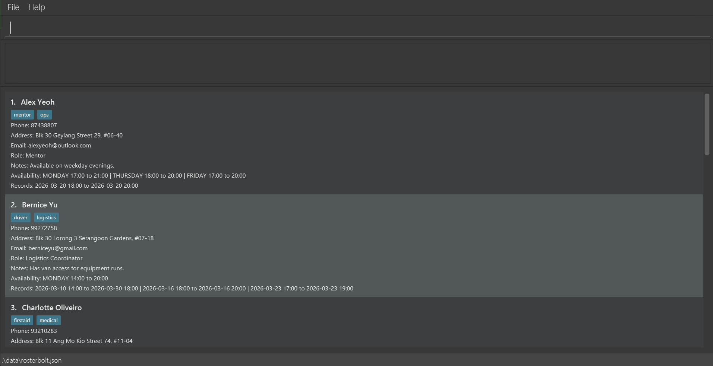

RosterBolt is a **desktop app for managing team contacts, optimized for use via a Command Line Interface** (CLI) while still having the benefits of a Graphical User Interface (GUI). If you can type fast, RosterBolt can get your contact management tasks done faster than traditional GUI apps.

RosterBolt is built for **volunteer coordinators** who run recurring events and manage **20-500 volunteers** on their own. It's a **single-user, offline, CLI-first** contact management tool designed for fast typists who prefer keyboards to mouse interactions, are comfortable with CLI apps, and may operate without Internet access.

RosterBolt reduces admin overhead by **streamlining repetitive tasks** (such as bulk deleting or modifying contacts) so you can manage volunteer manpower **efficiently and accurately**. It also lets you **track volunteer availability and volunteer service records**, **view participation statistics** at a glance, and **import/export volunteer data via CSV** for easy migration and sharing with other tools.

* Table of Contents
{:toc}

--------------------------------------------------------------------------------------------------------------------

## Quick start

1. Make sure you have Java `17` or above installed on your computer. 
   **Mac users:** Make sure you have the precise JDK version prescribed [here](https://se-education.org/guides/tutorials/javaInstallationMac.html).

1. Download the latest `.jar` file from [here](https://github.com/AY2526S2-CS2103T-T12-1/tp/releases).

1. Copy the file to the folder you want to use as the _home folder_ for your RosterBolt.

1. Open a command terminal (e.g., Terminal on Mac, Command Prompt or PowerShell on Windows), navigate to the folder you put the jar file in using `cd`, and run `java -jar RosterBolt.jar`. 
   A window similar to the one below should appear in a few seconds. It comes preloaded with some sample data so you can try out the commands right away. 
   

1. Type a command in the command box and press Enter to run it. For example, typing **`help`** and pressing Enter opens the help window. 
   Some example commands you can try:

   * `list` : Lists all contacts.

   * `add n/John Doe p/98765432 e/johnd@example.com a/John street, block 123, #01-01` : Adds a contact named `John Doe` to RosterBolt.

   * `delete 3` : Deletes the 3rd contact shown in the current list.

   * `clear` : Deletes all contacts.

   * `exit` : Exits the app.

1. Check out the [Features](#features) section below for a full walkthrough of each command.

--------------------------------------------------------------------------------------------------------------------

## Features

:exclamation: **Caution:**
If you're using a PDF version of this document, be careful when copying and pasting commands that span multiple lines as space characters surrounding line-breaks may be omitted when copied over to the application.

**:information_source: Notes about the command format:** 

* Words in `UPPER_CASE` are the parameters you need to fill in. 
  e.g. in `add n/NAME`, `NAME` is a parameter which can be used as `add n/John Doe`.

* Items in square brackets are optional. 
  e.g `n/NAME [t/TAG]` can be used as `n/John Doe t/friend` or as `n/John Doe`.

* Items with `…`​ after them can be used multiple times including zero times. 
  e.g. `[t/TAG]…​` can be used as ` ` (i.e. 0 times), `t/friend`, `t/friend t/family` etc.

* Parameters can be in any order. 
  e.g. if the command specifies `n/NAME p/PHONE`, `p/PHONE n/NAME` is also acceptable.

* If you accidentally type extra text after commands that don't take parameters (such as `help`, `exit`, `clear`, `bin`, `aliases` and `editprev`), the extra text is simply ignored. 
  e.g. if you type `help 123`, it's interpreted as `help`.

:exclamation: **Caution:**
For commands that validate prefixes, such as `add`, `edit`, and `find`, RosterBolt will flag text that **looks like** an unknown prefix (e.g., `x/value`) if it appears in your input.
Common abbreviations with a single character after the slash (such as `c/o` (care of), `w/o` (without)
or `w/` (with)) are recognised and allowed.

RosterBolt, however, does **NOT** support multiple-character abbreviations after the slash (e.g., `he/she`, `m/w/f`), and you're advised to avoid using such abbreviations in your input. 
Instead, please consider rephrasing the input to avoid the need for such abbreviations (e.g., `he or she`), or using supported single-character abbreviations (e.g., `h/s` instead of `he/she`).

**:information_source: Constraints on values in each field:** 

Any extra whitespaces at the start or end of a field value are automatically removed before validation. A field is considered blank if nothing remains after removing these spaces.

* **Name**: Letters, numbers, and spaces only. Must start with letters or numbers, and must not be blank.
* **Phone**: Numbers only, at least 3 digits.
* **Email**: Must be in `local-part@domain` format. The local-part is made up of alphanumeric chunks, optionally separated by single special characters (`+_.-`), and must start and end with an alphanumeric character. The domain is made up of one or more labels separated by periods. Each label must start and end with an alphanumeric character, may contain hyphens in between, and can't contain underscores. The last label must be at least 2 characters long. A single-label domain such as `localhost` is allowed.
* **Address**: Any characters allowed, but must not be blank after trimming.
* **Tag**: Letters and numbers only. Must not be blank.
* **Role / Notes**: No restrictions after trimming. Setting blank is equivalent to removing the role/notes.
* **Availability**: Must be in the format `DAY,HH:mm,HH:mm` (day, start time, end time), where `DAY` is a full day name (case-insensitive, e.g., `MONDAY`, `monday`, or `Monday`) and start time must be earlier than end time.
* **Record**: Must be in the format `yyyy-MM-ddTHH:mm,yyyy-MM-ddTHH:mm` (start date-time, end date-time), and start date-time must be earlier than end date-time.

### Viewing help : `help`

Opens a help window with a link to this user guide, in case you need a quick reference while using the app.

Format: `help`

### Adding a volunteer: `add`

Adds a new volunteer to your RosterBolt contact list.

You must be viewing the working list to use this command. Otherwise, you'll see an error message and the volunteer won't be added.

Format: `add n/NAME p/PHONE e/EMAIL a/ADDRESS [t/TAG]…​ [r/ROLE] [nt/NOTES] [va/AVAILABILITY]…​ [vr/RECORD]…​`

:bulb: **Tip:**
You can give a volunteer any number of tags (e.g., `logistics`, `firstaid`), availability slots, and volunteer records (including 0). Role and notes are optional.

* RosterBolt prevents duplicate entries. A volunteer is considered a duplicate if their phone number matches an existing contact exactly, or their email matches case-insensitively (e.g., `A@b.com` is treated as the same as `a@b.com`).
  * If a duplicate is found, the command won't go through, and you'll see an error message.
* See [field constraints](#field-constraints) for valid values for each field.

Examples:
* `add n/John Doe p/98765432 e/johnd@example.com a/John street, block 123, #01-01 r/Usher nt/Weekend only va/MONDAY,14:00,17:00 vr/2026-03-20T14:00,2026-03-20T17:00`
* `add n/Betsy Crowe t/friend e/betsycrowe@example.com a/Newgate Prison p/1234567 t/criminal r/Logistics nt/Prefers morning shifts va/SATURDAY,09:00,12:00 va/SUNDAY,13:00,16:00`
* `add n/Alex Tan p/91234567 e/alex@example.com a/NUS`

### Listing all volunteers : `list`

Lists all volunteers in your RosterBolt contact list, optionally sorted by a chosen attribute. This is useful for getting an overview of your roster or finding volunteers in a particular order.

Format: `list [ATTRIBUTE [asc|desc]]`

* Currently supported `ATTRIBUTE`: `name`, `phone`, `email`, `role`, `tag`, or `vr`.
* Order defaults to `asc` when omitted.
* Omitting `ATTRIBUTE` shows the list in the default order.
* `vr` sorts by the end time of each volunteer's most recent volunteer record. Use `list vr asc` to see who hasn't served recently (useful for distributing duties fairly), or `list vr desc` to see who served most recently.
  * Volunteers without any volunteer records are treated as least-recently served (i.e., they appear first when sorting in ascending order, so you can easily spot who hasn't served yet).

Examples:
* `list`
* `list name`
* `list email desc`
* `list vr desc`

### Creating a command alias : `alias`

Creates a custom shortcut (i.e., alias) for a built-in command. For example, if you frequently list your volunteers, you can type `alias ls list` so that typing `ls` works the same as `list`, saving you keystrokes during busy event days.

Format: `alias SHORT COMMAND_WORD`

* Your alias (`SHORT`) must start with a lowercase letter and contain only lowercase letters, numbers, or hyphens (like a command word).
* `COMMAND_WORD` must be exactly one of the supported built-in commands: `add`, `bin`, `clear`, `delete`, `edit`, `exit`, `export`, `find`, `help`, `import`, `list`, `restore` or `stats`.
* When you use an alias, RosterBolt replaces only the alias with the full command word. Everything else you type after is kept as-is.
* `alias`, `aliases`, `unalias`, and `editprev` can't be used as alias targets.
* Your aliases are saved in your preferences file (`preferences.json`), and not in the volunteer data file, so they won't be lost if you clear or reset your roster.
* If RosterBolt detects invalid aliases in `preferences.json` when it starts up, it removes them and shows you a one-time notice.

Examples:
* `alias ls list`
* `alias rm delete`
* `alias wipe clear`

### Listing command aliases : `aliases`

Lists all the command aliases you've set up, so you can check what shortcuts are available.

Format: `aliases`

### Removing a command alias : `unalias`

Removes an existing command alias, so you can remove an alias that you no longer need.

Format: `unalias SHORT`

Examples:
* `unalias ls`

### Showing recycle bin of recently deleted volunteers : `bin`

Shows the recycle bin, where you can see volunteers you've recently deleted. This gives you a safety net, so if you accidentally remove someone, you can find them here and restore them.

Format: `bin`

* Volunteers removed by the `delete` or `clear` commands are automatically placed in the recycle bin.
* The recycle bin can contain duplicate volunteers with the same phone number or email. For example, if you delete a volunteer, add a new one with the same phone number, and then delete the new one too, both appear in the recycle bin, so long as they aren't **completely identical** in every field.
   * If both volunteers are **completely identical** in every field, only one of them is kept in the recycle bin.
* The recycle bin is cleared when you close RosterBolt, so make sure to restore any accidentally deleted volunteers before exiting.

### Editing a volunteer : `edit`

Edits the details of a volunteer that's already in your RosterBolt contact list. Use this when a volunteer changes their phone number, email, availability, or any other information.

You must be viewing the working list to use this command. Otherwise, you'll see an error message and no changes will be made.

Format: `edit INDEX [n/NAME] [p/PHONE] [e/EMAIL] [a/ADDRESS] [r/ROLE] [nt/NOTES] [t/TAG]…​ [va/AVAILABILITY]…​ [vr/RECORD]…​`

* Edits the volunteer at the specified `INDEX`. The index is the number shown next to each volunteer in the currently displayed contact list, and **must be a positive integer** (1, 2, 3, ...).
* You must provide at least one field to edit.
* The values you provide replace the existing values for those fields.
* When you edit tags, availabilities, or records, the new values **replace all existing values** for that field (i.e., they aren't added on top of the old ones).
* You can remove all the volunteer's tags, availabilities, records, role, or notes by typing `t/`, `va/`, `vr/`, `r/`, or `nt/` without specifying values after the prefix.
* See [field constraints](#field-constraints) for valid values for each field.

Examples:
*  `edit 1 p/91234567 e/johndoe@example.com va/MONDAY,18:00,20:00` Edits the phone number, email address, and availability of the 1st volunteer.
*  `edit 2 n/Betsy Crower t/ va/ vr/` Edits the name of the 2nd volunteer and clears all existing tags, availabilities, and records.

### Finding volunteers by keyword: `find`

Finds volunteers in your RosterBolt contact list matching any of the given keywords, with an optional filter for availability. This is handy when you need to quickly find a specific volunteer, or locate everyone who's free on a particular day and time for an upcoming event.

Format: `find [m/MATCH_TYPE] [va/DAY,HH:mm,HH:mm] [KEYWORD [MORE_KEYWORDS]]`

* The search is case-insensitive. e.g. `hans` matches `Hans`
* The order of the keywords doesn't matter. e.g. `Hans Bo` matches `Bo Hans`
* The search covers all fields: name, phone, email, address, role, notes, and tags.
* `m/kw` (keyword) matches full words only. e.g. `Han` doesn't match `Hans`
* `m/ss` (substring) matches substrings (i.e., parts of words). e.g. `Han` matches `Hans`
* `m/fz` (fuzzy) allows small spelling mistakes. Words that are up to 2 edits away (in terms of adding, removing, or changing a letter) can still match. e.g. `michigan` matches `michegan`
* `va/DAY,HH:mm,HH:mm` filters for volunteers whose availability covers the specified time period, i.e. the volunteer's availability is on the same day, starts at or before the specified start time, and ends at or after the specified end time. See [field constraints](#field-constraints) for the `AVAILABILITY` format.
* At least one of keywords or `va/` must be provided.
* When both keywords and `va/` are provided, only volunteers matching **both** the keyword search **and** the availability filter are returned.
* If `m/MATCH_TYPE` is specified, at least one keyword must also be provided.
* If you provide multiple keywords, volunteers matching **any** of them are shown (i.e. it's an `OR` search).
  e.g. `Hans Bo` returns `Hans Gruber`, `Bo Yang`
* `MATCH_TYPE` is optional. If you don't specify one, keyword matching (`m/kw`) is used by default.
* Currently supported `MATCH_TYPE`: `kw`, `ss`, `fz`.

Examples:
* `find John` returns `john` and `John Doe`
* `find alex david` returns `Alex Yeoh`, `David Li` 
  
* `find m/kw John` also returns `john` and `John Doe`
* `find m/ss ali` returns `Alice Pauline` and `Ali Tan`
* `find m/fz michigan` returns `Elle Meyer` (address: `michegan ave`)
* `find va/MONDAY,14:00,17:00` returns all volunteers available on Monday from 14:00 to 17:00
* `find va/MONDAY,14:00,17:00 alice` returns volunteers matching `alice` who are also available on Monday from 14:00 to 17:00

### Viewing volunteer statistics : `stats`

Displays a quick overview of your volunteer roster through text-based charts. Use this to spot patterns, like which roles are understaffed or who your most active volunteers are.

Format: `stats CATEGORY`

* Currently supported `CATEGORY`: `role`, `record`.
* `role` shows the percentage breakdown of volunteer roles. Volunteers without a role are shown as `Unassigned`.
* `record` ranks volunteers by how many volunteer records they have, so you can see who has been most (or least) active.

Examples:
* `stats role`
* `stats record`

### Deleting a volunteer : `delete`

Deletes volunteer(s) from your RosterBolt contact list. Don't worry, deleted volunteers are moved to the recycle bin, so you can [restore](#restoring-a-deleted-volunteer--restore) them if needed.

You must be viewing the working list to use this command. Otherwise, you'll see an error message and no volunteer(s) will be deleted.

Format: `delete INDEX [MORE_INDICES]`

* Deletes the volunteer(s) at the specified indices.
* The indices are the numbers shown next to each volunteer in the currently displayed contact list.
* Each index **must be a positive integer** (1, 2, 3, ...) and can't exceed the number of volunteers in the currently displayed list.
* If you accidentally repeat an index, the duplicate indices are simply ignored.
* All deleted volunteers are moved to the recycle bin.

Examples:
* `list` followed by `delete 2 3` deletes the 2nd and 3rd volunteers in RosterBolt.
* `list` followed by `delete 3 3 2` has the same behavior, as duplicate indices are ignored and the order of indices doesn't matter.
* `find Betsy` followed by `delete 1` deletes the 1st volunteer in the results of the `find` command.

### Restoring a deleted volunteer : `restore`

Restores volunteers that were previously deleted in the current session, recovering them from the recycle bin.

You must be viewing the recycle bin to use this command. Otherwise, you'll see an error message and no volunteers will be restored.

Format: `restore INDEX [MORE_INDICES]`

* Restores the volunteers at the specified indices in the recycle bin.
* The indices are the numbers shown next to each entry in the recycle bin.
* Each index **must be a positive integer** (1, 2, 3, ...).
* If you accidentally repeat an index, the duplicate indices are simply ignored.
* Restored volunteers are moved out of the recycle bin and added back into your active contact list.
* You can't restore a volunteer if someone with the same phone number or email already exists in your active contact list. The command will be rejected with an error explaining the conflict.
* Similarly, you can't restore two volunteers that share the same phone number or email in a single `restore` command.

Examples:
* `bin` followed by `restore 2 3` restores the 2nd and 3rd volunteers in the recycle bin.
* `bin` followed by `restore 3 3 2` has the same behavior, as duplicate indices are ignored and the order of indices doesn't matter.

### Importing volunteers from a CSV file : `import`

Imports volunteers in bulk from a CSV (spreadsheet) file. This is useful when onboarding a large group of new volunteers at once, or migrating data from another tool.

Format: `import FILE_PATH`

* Your CSV file must include the column headers `name`, `phone`, `email`, and `address`. 
  * The following headers are optional: `role`, `notes`, `tags`, `availabilities`, `records`.
* If the file can't be found or read, the import fails, and you'll see an error message.
* Values in each column must conform to the [field constraints](#field-constraints).
* Rows with invalid data are skipped, but valid rows in the same file are still imported, meaning one bad row doesn't block the rest.
* Rows that match an existing contact's phone number or email are also skipped to avoid duplicates.
* After the import finishes, you'll see a summary showing:
  * The number of volunteers successfully imported,
  * The number of duplicate rows skipped,
  * The number of invalid rows skipped, and
  * The row numbers and reasons for any skipped rows.

Examples:
* `import data/volunteers.csv`

### Exporting volunteers to a CSV file : `export`

Exports all your active volunteers to a CSV (spreadsheet) file. This is useful for creating backups, sharing your roster with others, or working with the data in spreadsheet software like Excel or Google Sheets.

Format: `export FILE_PATH`

* If a file already exists at the given path, it's overwritten without warning, so double-check the path to avoid accidentally replacing an important file.

Examples:
* `export data/volunteers.csv`

### Clearing all entries : `clear`

Clears all volunteers from your active contact list at once. This is a quick way to start fresh, as all removed volunteers are moved to the recycle bin so you can still [restore](#restoring-a-deleted-volunteer--restore) them before closing the app.

You must be viewing the working list to use this command. Otherwise, you'll see an error message and your contacts won't be cleared.

Format: `clear`

* All removed volunteers are placed in the recycle bin.

### Exiting the program : `exit`

Exits RosterBolt. Your volunteer data is saved automatically, but the recycle bin will be cleared, so make sure you've restored any accidentally deleted volunteers before exiting.

Format: `exit`

### Editing the previous command : `editprev`

Loads your last successfully run command (other than `editprev` itself) back into the command box for you to edit and re-run. This saves you from retyping long commands.

Format: `editprev`

* Only the most recent successful command (excluding `editprev`) is remembered for the current session.
* The recalled command isn't run automatically, meaning you can edit it first and press Enter when you're ready.

Examples:
* `list` followed by `editprev` loads `list` back into the command box.
* `delete 1` followed by `editprev` loads `delete 1` back into the command box for editing.

### Saving the data

Your volunteer data is saved to disk automatically whenever you make a change. There's no need to save manually.

If a command runs successfully but RosterBolt can't save to disk (e.g., due to a file permissions issue), you'll see the command's success message along with a warning that the changes weren't saved and will be lost if you close the app.

### Editing the data file

Your volunteer data is stored as a JSON file at `[JAR file location]/data/rosterbolt.json`. If you're an advanced user who's comfortable editing JSON, you can update the data directly in this file.

:exclamation: **Caution:**
If your edits make the file's format invalid, RosterBolt discards all data and starts with an empty file on the next launch. Always back up the file before editing it. 
Additionally, entering values outside the acceptable range can cause unexpected behaviour. Only edit the data file if you're confident you can do so correctly.

--------------------------------------------------------------------------------------------------------------------

## FAQ

**Q**: How do I transfer my data to another computer? 
**A**: Install RosterBolt on the other computer, then copy the data file from your old RosterBolt home folder and use it to replace the empty data file in the new installation.

--------------------------------------------------------------------------------------------------------------------

## Known issues

1. **When using multiple screens**, if you move the application to a secondary screen, and later switch to using only the primary screen, the GUI opens off-screen. The remedy is to delete the `preferences.json` file created by the application before running the application again.
2. **If you minimize the Help Window** and then run the `help` command (or use the `Help` menu, or the keyboard shortcut `F1`) again, the original Help Window will remain minimized, and no new Help Window will appear. The remedy is to manually restore the minimized Help Window.

--------------------------------------------------------------------------------------------------------------------

## Command summary

<!-- The `list` row uses a Unicode fullwidth vertical bar (U+FF5C: ｜) instead of ASCII pipe (|) to avoid breaking the Markdown table. -->
Action | Format, Examples
--------|------------------
**Add** | `add n/NAME p/PHONE e/EMAIL a/ADDRESS [t/TAG]…​ [r/ROLE] [nt/NOTES] [va/AVAILABILITY]…​ [vr/RECORD]…​`   e.g., `add n/James Ho p/22224444 e/jamesho@example.com a/123, Clementi Rd, 1234665 t/friend t/colleague r/Usher nt/Available weekends va/SUNDAY,14:00,17:00 vr/2026-03-20T14:00,2026-03-20T17:00`
**Alias** | `alias SHORT COMMAND_WORD`  e.g., `alias ls list`
**Aliases** | `aliases`
**Unalias** | `unalias SHORT`  e.g., `unalias ls`
**Bin** | `bin`
**Clear** | `clear`
**Delete** | `delete INDEX [MORE_INDICES]`  e.g., `delete 2 3`
**Edit** | `edit INDEX [n/NAME] [p/PHONE] [e/EMAIL] [a/ADDRESS] [r/ROLE] [nt/NOTES] [t/TAG]…​ [va/AVAILABILITY]…​ [vr/RECORD]…​`  e.g., `edit 2 n/James Lee e/jameslee@example.com va/MONDAY,14:00,17:00`
**Edit Previous** | `editprev`
**Export** | `export FILE_PATH`  e.g., `export data/volunteers.csv`
**Find** | `find [m/MATCH_TYPE] [va/DAY,HH:mm,HH:mm] [KEYWORD [MORE_KEYWORDS]]`  e.g., `find m/kw James Jake`, `find m/ss ali`, `find m/fz michigan`, `find va/MONDAY,14:00,17:00`, `find va/MONDAY,14:00,17:00 alice`
**Import** | `import FILE_PATH`  e.g., `import data/volunteers.csv`
**List** | `list [ATTRIBUTE [asc｜desc]]`  e.g., `list name desc`, `list vr desc`
**Exit** | `exit`
**Help** | `help`
**Restore** | `restore INDEX [MORE_INDICES]`  e.g., `restore 2 3`
**Stats** | `stats CATEGORY`  e.g., `stats role`, `stats record`
